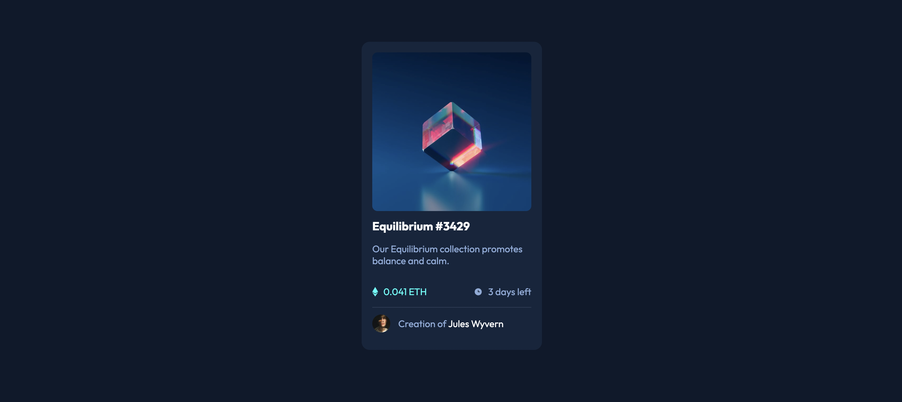

# Frontend Mentor - NFT preview card component solution

This is a solution to the [NFT preview card component challenge on Frontend Mentor](https://www.frontendmentor.io/challenges/nft-preview-card-component-SbdUL_w0U). Frontend Mentor challenges help you improve your coding skills by building realistic projects. 

## Table of contents

- [Overview](#overview)
  - [The challenge](#the-challenge)
  - [Screenshot](#screenshot)
  - [Links](#links)
- [My process](#my-process)
  - [Built with](#built-with)
  - [What I learned](#what-i-learned)
  - [Continued development](#continued-development)
- [Author](#author)

**Note: Delete this note and update the table of contents based on what sections you keep.**

## Overview

### The challenge

Users should be able to:

- View the optimal layout depending on their device's screen size
- See hover states for interactive elements

### Screenshot



### Links

- Solution URL: https://github.com/luenlun/frontendmentor-NFT-preview-card-component
- Live Site URL: https://luenlun.github.io/frontendmentor-NFT-preview-card-component/

## My process

### Built with

- Semantic HTML5 markup
- CSS custom properties
- Flexbox

### What I learned

In this challenge, I learned:

- Centering a svg element in a div box
- overlaying color on an image
- Creating a reposive square div box

The most challenging part is the Card Image with a view-icon with color ovarlay when hovering. In the first try, I divided it into three component: a div box, an image and a svg icon, but then I found it difficult to correctly center the icon on the image.

After studying different resources on the web, I simplified it: a div box with background-image and an svg icon. To easily center the svg icon on the image, I set the position of the div box to relative and the svg icon to absolute so the svg icon is positioned relative to its parent: the div box.

```css
parent-div {
  position: relative;
}
child svg {
  position: absolute;
}
```

The Card Image acted as the background image of the div box and so the div box needed to be responsive square to fit the image. I learned the use of padding-top to make it responsive square:

```css
image-box {
  width: 100%;
  padding-top: 100%;
}
```
As the svg icon was absolute positioned, it was not affected by the padding and can be easily centered:

```css
svg-icon {
  left: 50%;
  top: 50%;
  transform: translate(-50%, -50%);
}
```
Final Challenge was overlaying color on background image when hovering. After research, I learned that it can be done by linear-gradient with two same color-stop, which means no graident at all:

```css
image-box:hover {
  background: linear-gradient(color1, color1), backgraound-image;
}
```

All DONE!

### Continued development

I am new to HTML and CSS. I started learning from freecodecamp and w3school few months ago. I am not sure if the above solution is the best solution and it would be great if you may have a better suggestion.

## Author

- Frontend Mentor - [@luenlun]
- Twitter - [@luenlun]
